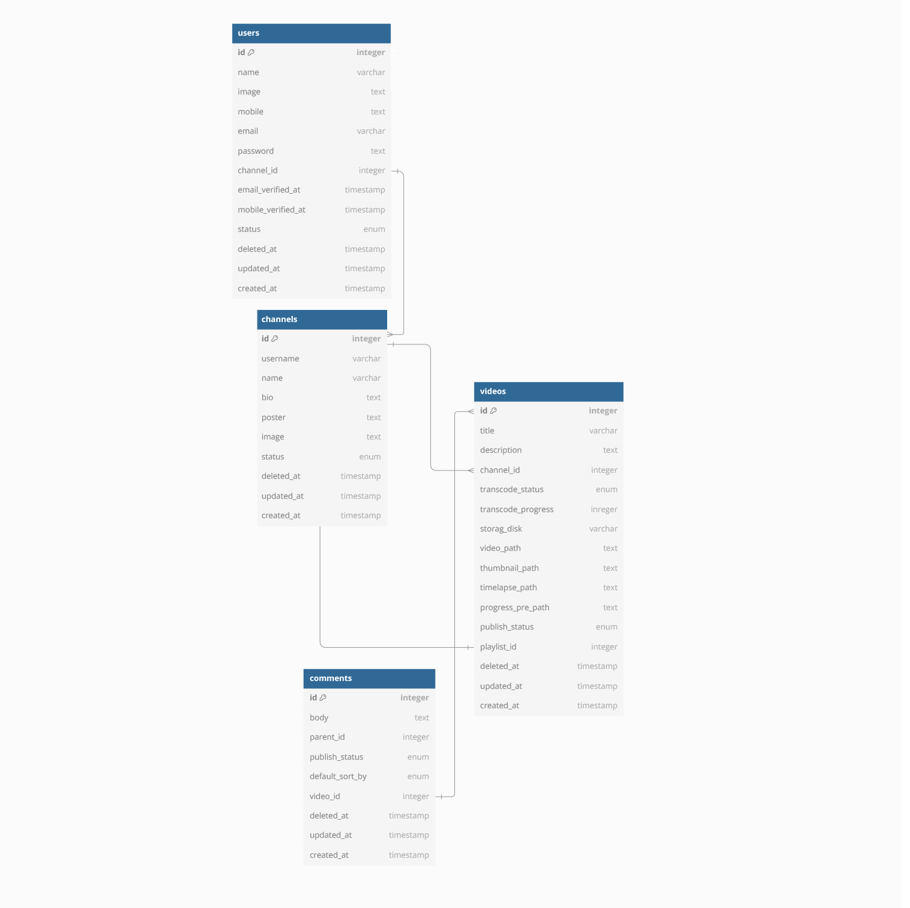
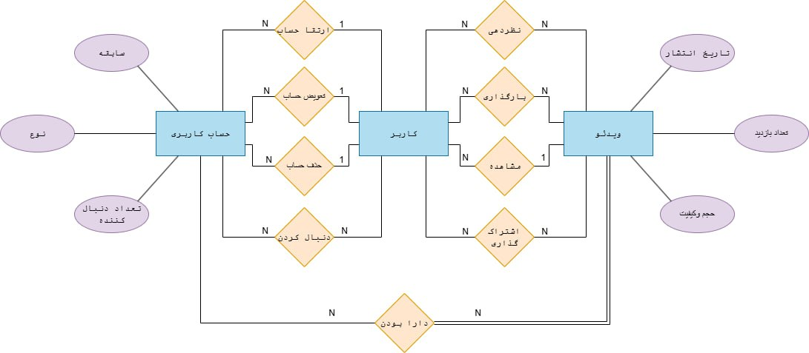

# Videos-Streamer Postgres database assignment

# سروین رفتاری و کیمیا حیدری

#### this repo contains main queries for making a simple video streamer database for a youtube like project. it includes the nessecary backup file of the whole project and the seperated queries.

#### the contents are as described bleow.

# Queries

### Channels

####  it includes all the interactions with channels including its name and three levels of authority for accessablity.

### Comments

#### it includes all the users intercations toward a single movie that has been uploaded.

### Users

#### this table is made of all the records of the users including admins, owners, and regular users. this is where we store all of their infos and keep all the private data.

### Videos

#### this table contains all the vidoes that we have uploaded.

### Playlists

#### this table contains a collection of the things that we like to group together so that we can see together

### Reactions 

#### these are the users interaction with the videos either its positive or negative

### Subscriptions

#### these are the users who have subscribed to the streamer and the services which we provide to them.

# Sketches (ER)

#### here we see the main Entity relationship where we dicided to place our certain infos like titles posters and name inside a json called meta this is due to better data management when developing the application so that we only need a single query to attain meta and display informative informations

